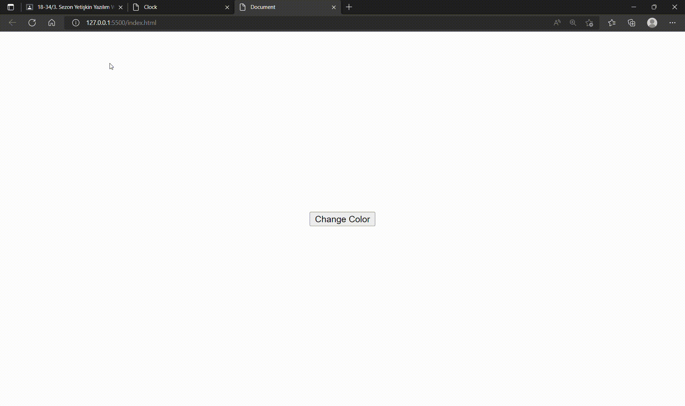

# RowedColor_Changer

<h1>A simple dynamic color-changer!
<h3>A button has a trigger influence to change the color array having a certain row. As the show comes to end, it turns back the initial position. Therefore, continuality is acquired. 
